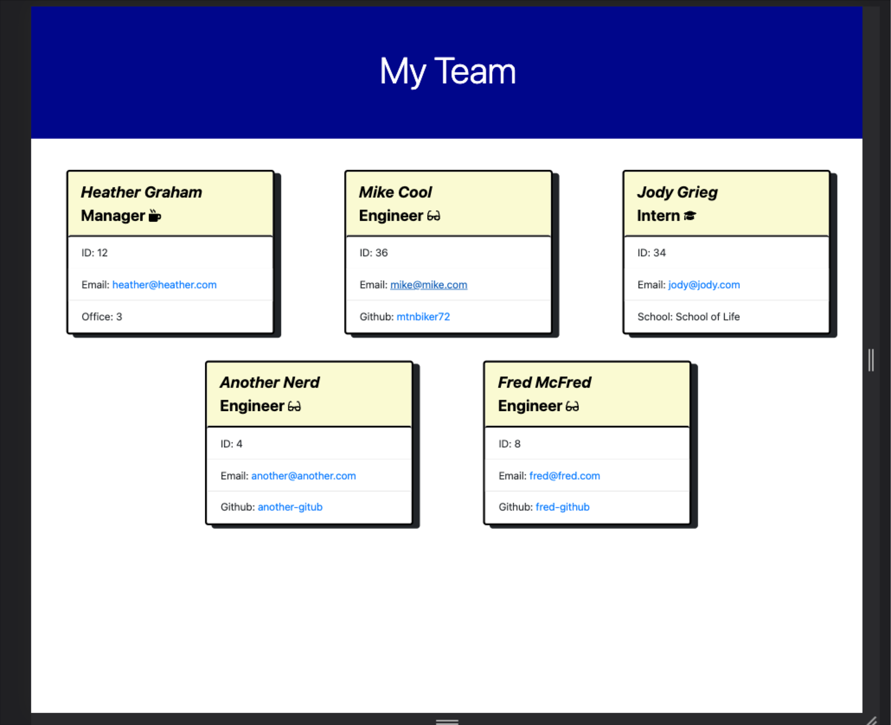

# HOMEWORK #10 - Team Profile Generator
The team-profile-generator code can be accessed at:

https://github.com/mtnbiker72/team-profile-generator

## Required Modules:
* Jest for testing
* Inquirier for user input

## Description
This assignment is to build a node.js command-line app that takes information about employees on a software team and generates an HTML webpage that displays summaries for each person.  Tests should be written for each part of the code to verify the code is maintainable.

 * Command line interface that allows user to accept manager, intern, and engineer positions
 * The inquirer module is used to accept user input
 * Once the manager is added, the user can add interns and engineers
 * If the employee is a manager, the office number is requested
 * If the employee is an intern, the school they went to is requested
 * If the employee is an engineer, their github account is requested
 * Once all employees have been added, an HTML file is generated
 * The HTML file is formatted nicely
 * The Github name is a link to their github account
 * For every employee, the email address is a link that opens default email browswer and sends to name in the link
 * Test cases are written for each class and they all pass
 * Jest is used for unit testing

## Usage
node index.js

## Pictures
